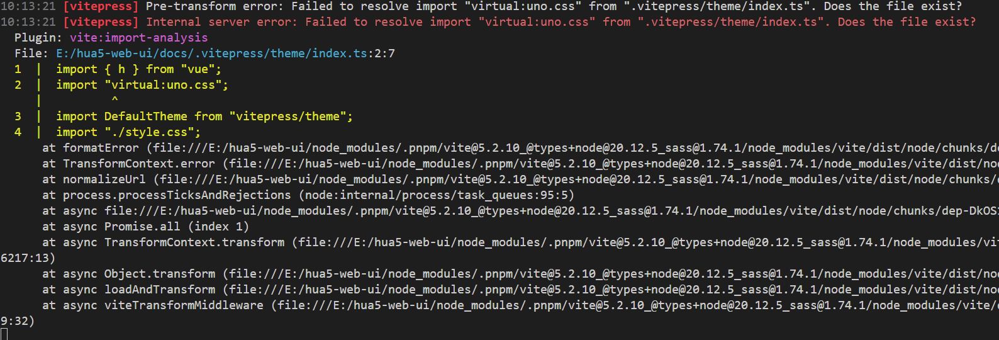

# UnoCSS

## vitepress 使用 unocss 方式

## 步骤

1、安装unocss

```javascript
pnpm add -D unocss
```

2、在config.mts也就是入口文件中配置vite的unocss插件

``` javascript
import UnoCSS from 'unocss/vite'

export default defineConfig({
  title: "测试",
  description: "测试",
  vite:{
    plugins: [
      UnoCSS()
    ]
  },
  themeConfig: {}
})
```


3、在.vitepress/theme/index中导入unocss

```javascript
import "virtual:uno.css";
```

4.重启项目即可

### 报错

如果遇到下面这样的报错，请仔细检查第二步是否正确。
Internal server error: Failed to resolve import “virtual:uno.css” from “.vitepress/theme/index.ts”. Does the file exist

</img>