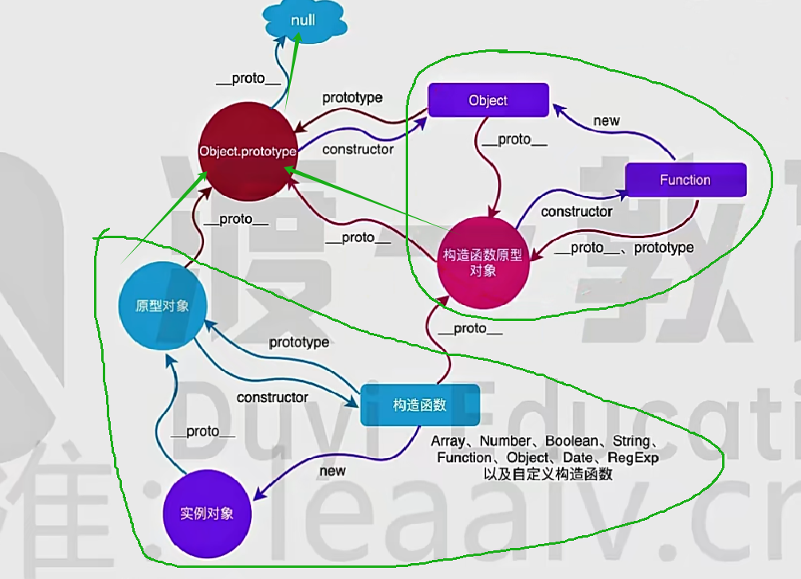

# 前端题

废话不多说，上一篇 [在这](./2.前端一些题.md)

## HTML

### 1. `<!DOCTYPE html>`文档声明，为什么html5这么短，其他版本的浏览器文档引入很长呢？

- 因为不需要引用DTD文件了，因为最新的HTML5不基于SGML
- html以前的SGML太严谨不易学、不易用、难以实现
- H5开发 ≈ HTML5 + CSS3 + ES6

### 2. 浏览器的渲染模式-怪异模式（混杂模式）、严格模式（标准模式）、几乎标准模式

- 早起 网景和微软实现css的时候各自存在标准，后来有了w3c标准，但是要兼容以前的模式，所以才有了怪异模式
- 怪异模式中宽高算法不同、怪异模式行内元素可以设置宽高等

### 3. 对html语义化的理解

- 什么是语义元素（标签）
- 为什么要语义化（没有css也可以解析、有利于SEO、提升用户体验、便于团队开发维护、方便其他设备解析：比如屏幕阅读器、盲人阅读器）
- 无障碍网页，h5在无障碍方面加强，引入了无障碍属性。屏幕阅读器可以朗读或者输出盲文

### 4. 对WEB标准以及W3C的理解与认识

- world wide web consortium 万维网联盟
- W3C是一个会员组织，工作是对web进行标准化
- 正是标准才让以后的网页不需要走怪异模式

### 5. 描述SEO中的TDK

- 内部优化：
  - search engine optimization（搜索引擎优化）
  - 内部优化，合理的title、description、keywords（TDK），后面二者是meta标签

      ```html
      <title>最佳旅游目的地 | 2024年度热门旅游地推荐</title>
      <meta name="description" content="探索2024年最佳旅游目的地。查看我们的推荐，计划您的下一个梦幻假期！">
      <meta name="keywords" content="最佳旅游目的地, 2024年热门旅游地, 旅游推荐, 梦幻假期">
      ```

  - alt填充，重要的内容放前面
  - 少用`iframe`，`display:none`
- 外部优化：友情链接

### 6. 什么是微格式，前端构建需要考虑微格式么

- 微格式基于简单的标记约定，赋予意义，兼顾HTML文档的人机可读性，在标签中添加语义注解，class也是微格式
- 意义:
  - SEO更准确
  - 对内容进行操作，还可以将其转化为其他相关格式，提供给外部程序或web服务

### 7. 什么是替换元素、什么是非替换元素、各自的特点

- 替换元素：img、iframe、video、audio,一些展示效果不由css来控制的
- 非替换元素：展示效果完全由css控制

## CSS

### 1. CSS中有哪些单位

- 绝对单位(cm、pt(与打印一致)、px)
- 相对单位(em(根据父容器的fontSize)、rem(根据根元素的fontsize)、vw(视口宽度)、vh(视口高度))

### 2. 怎么让一个盒子居中

- 水平居中
  - mragin:0 auto;
  - 父元素flex布局
  - 父元素相当定位，当前元素绝对定位
- 垂直居中
  - 父元素 vertical-align: middle
  - 父元素flex布局
  - 父元素相当定位，当前元素绝对定位

### 3. 怎么隐藏一个元素

- 完全隐藏
  - display: none
  - 元素上写hidden    相当于给元素增加了 display: none
- 视觉隐藏
  - `opacity: 0`
  - `visibility: hidden`
  - `clip-path: polygon(0 0,0 0,0 0,0 0)`
- 语义隐藏---使读屏软件不可读
  - aria-hidden: true

### 4. 清除浮动

- 在父元素中设置height，这个height要不小于子元素的height
- 隔墙法多写一个`div：clear:both`
- `::after {content: "";display: block;clear: both;}`
- overflow：hidden，形成一个BFC

### 5. 绝对定位

- top是相对于页面左上角定位(有父元素看父元素border左上角，也就是说有padding也算)
- bottom是相当于首屏下侧的位置定位

### 6. BFC

- body是一个天然的BFC(块级格式化上下文)
- float
- postion:absolute、fixed
- overflow:auto、scroll、hidden
- display:inline-block、table-cell 以上几个方式都会构建BFC
- 独立的空间，内部元素布局与外部互不影响
- 作用:
  - 解决浮动元素父元素高度塌陷
  - 解决非浮动元素被浮动元素覆盖
  - 解决外边距重合

### 7. CSS属性的计算过程

- 确定声明值（参考样式表（作者样式表和浏览器默认样式表）里没有冲突的声明，作为css属性值）
- 层叠冲突（多个样式冲突问题,详情见问题8）
- 使用继承（父中拿）
- 使用默认值（系统默认）

### 8. CSS层叠继承规则总结

- 重要性(important)：无脑提高优先级
- 专用性(specificity)：指dom的内联style > id选择 > class选择器 > h1、p等
- 源代码次序(source order)：写的一样后引用的覆盖

### 9. CSS引用的方式有哪些(link import)

```css
@import url('./index.css')
```

```css
@import url('./index.css') screen and (max-width: 500px)
```

```html
<link rel="stylesheet" href="index.css" media="screen" />
<!--  
- link 除了加载css外还可以定义rel等，@import只能加载css
- @import在css加载完才会继续下载另一个
- 换皮肤只能用link，@import毕竟不是标签
-->
```

### 10. calc函数

- 支持所有CSS长度单位，运算法前后都需要保留一个空格

### 11. 媒介(media)查询

```css
@media screen and (max-width: 500px){
}
```

### 12. CSS3中transtion和animation的属性分别有哪些、动画如何实现

- transtion 过渡效果(property duration timing-function(linear、ease等) delay)
- animation 动画(css 定义一个一个动画)

### 13. 渐进增强和优雅降级

- 渐进增强（向上兼容）
- 优雅降级（向下兼容）

  ```css
   .transition{    /* 渐进增强 */
      -webkit-transition:all .5s;
      -mo2-transition:all .5;
      -o-transition:all .5s;
      transition:all .5s;
   }
   .transition{    /* 优雅降级 */
      transition:all .5s;
      -o-transition:all .5s;
      -mo2-transition:all .5;
      -webkit-transition:all .5s;
   }
  ```

### 14. 什么是渐进式渲染

    渐进式渲染，也被称为惰性渲染，为了提高用户感知的加载速度，以尽快的速度来呈现页面。他是一系列技术的集合：
    - 骨架屏
    - 图片懒加载
    - 图片占位符
    - 资源拆分

### 15. css优化有哪些

    - 使用id查找很快
    - 避免深层次的查询 div>div>div>p
    - 不要使用属性选择器
    - 遵守CSSlint规则
    - 避免过分重排

## JS

### 1. let const var

- var

```js
{
   var a = 10 // 块级作用域
}
console.log(a) // 10
```

```js
var a = 10
function test(){
   var b = 20
   console.log(a) // 10
   console.log(b) // 20
}
test()
console.log(b) // ReferenceError: b is not defined
```

```js
console.log(a) // undefined
var a = 10

function test(){
   console.log(a) // undefined
   var a;
}
```

- let

```js
{
   let a = 10  // let不可以变量提升到块级作用域之外
}
console.log(a) // ReferenceError: a is not defined
```

- const
  - 必须立即初始化
  - 常量不可改变

### 2. 值和引用

- 基本类型(string symbol number boolean null undefined),不可再细化
- 引用类型(object)
- 因为typeof 判断是不是对象是通过转为2进制后前三位是不是0判断的，而null全是0，所以判断是object
- null表示空，undefined表示已声明未赋值

### 3. 包装类型

```js
var i = 1;
i.toString();
// 当调用属性方法的时候，内部自动创建了一个new String()的实例
// 调用方法
// 销毁实例
```

- 什么时候会涉及呢？
  - 只要涉及到读取操作就会触发
- 基本类型给他挂在属性的时候，`'st'.a = 1`,在挂载完就会直接销毁
  - 而在这里也会执行一次包装类型的操作

```js
var i = 1;
i.test = 'hello'
console.log(i.test); // undefined
// 这里之所以没有是因为构建了一个临时的 new Number(1)，挂载完又销毁了

var i = new Number(1)
i.test = 'hello'
console.log(i.test); // hello
```

### 4. 类型转化

- 强制转换(显式转换)
- 自动转换(隐式转换)
首先要知道一个知识点 `valueOf`和`toString`挂载在所有对象方法上。

强制转换：

对于`Number()`：

```js
console.log(Number('123')) // 123
console.log(Number('xxx')) // NaN
console.log(Number('')) // 0
console.log(Number(true)) // 1
console.log(Number(false)) // 0
console.log(Number(null)) // 0
console.log(Number(undefined)) // NaN

// paeseInt会尽量可能的转换
console.log(paeseInt('123xxx')) // 123
console.log(paeseInt('xxx123')) // NaN
console.log(paeseInt(null)) // NaN
console.log(paeseInt(undefined)) // NaN

// 对于对象的Number()：
// 1. 先调用对象自身的valueOf方法，如果返回原始类型同上
// 2. 如果返回还是对象，则调用对象自己的toString方法，如果返回原始类型同上
// 3. 如果还返回对象就报错
var obj = { name:1 }
console.log(Number(obj)) // NaN
// 首先，valuOf 还是本身 { name:1 }；
// 然后toString是[object Object]
// 最后转为NaN

console.log(Number([1,2,3])) // NaN  这里的toSring会变成  1,2,3 有逗号
console.log(Number([1])) // 1 而这里会变成  1  没有逗号

// 所以你可以这么玩 // 2
console.log(Number({
    valueOf: () => 2
}))

// 25
console.log(Number({
    toString: () => 25
}))
```

对于`String()`:

```js
// 对于基本值来说很简单，进去什么出去什么string
console.log(String(Symbol(111))) //Symbol(111)

// 对于对象的String()：
// 1. 先调用对象自身的toString方法，如果返回原始类型同上
// 2. 如果返回还是对象，则调用对象自己的valueOf方法，如果返回原始类型同上
// 3. 如果还返回对象就报错
```

对于`Boolean()`:

```js
console.log(Boolean(''));
console.log(Boolean(0));
console.log(Boolean(null));
console.log(Boolean(undefined));
console.log(Boolean(NaN));
// 以上都是false，其他都是true
```

自动转换：

```js
// 自动转换为布尔
console.log(!'abc');

// 自动转换为字符串
// 字符串加法运算的时候，另一个值会先用String()转为字符串
'5' + 1 // '51'
'5' + true // '5true'
'5' + {} // '5[object Object]'
'5' + [] // '5'
'5' + function (){} // '5function (){}'
'5' + null // '5null'
'5' + undefined // '5undefined'
// 如果有一个值是 new Date(),那么也是用String()

// 自动转换为数值
// 某些运算会自动转为数值，使用Number()方法
'5' - '2' // 3
'5' * '2' // 10
'5' * [2] // 10
'5' * [] // 0
'5' * [1,2] // NaN
null + 1 // 1
undefined + 1 // NaN

// 一元运算符也会转为数值
+'abc' // NaN
+true // 1
```

### 5. 前端运算符

- % 取余运算的时候,正负号由前一个数的正负号决定：

```js
console.log(-1 % 2) // -1
console.log(1 % -2) // 1
```

- ** 指数运算符

```js
2 ** 4 //16
2 ** 3 ** 2 //512   因为这个是右结合，相当于 2 ** (3 ** 2)，即 2 ** 9
```

- 比较运算法
  - 如果有一个是数字，另一个会转为数字
  - 如果两边都是字符串，比较 `Unicode` 码点
  - 如果一边字符串，另一边是对象，或者两边都是对象，则先String()

```js
// NaN做比较的时候永远是false，做计算的时候是NaN
console.log(5 > []) // true
console.log(5 > {}) // false
console.log(5 < {}) // false
console.log(5 + {}) // NaN
console.log(5 - {}) // NaN
console.log(5 * {}) // NaN
console.log(5 / {}) // NaN

// Unicode码点收录了很多语言，包括中文
console.log('大'>'小') // false  '大'的码点是22823   '小'的码点是23567
console.log([2] > [1]) // true
console.log([2] > [11]) // true
```

- = 相等运算符

```js
1 === 0x1 // true 16进制表示
3 === 0b11 // true 2进制表示
-0 === 0 // true

// 这里a b都转为了[object Object]
const a = {},b = {};
console.log(a>b) // false
console.log(b>a) // false

// 这里比较的是两个对象的引用地址
console.log(a==b) // false
console.log(a===b) // false
```

- == 双等运算符，会先做Number转换,当然 != 也是一样的

```js
[1,2] == '1,2' // true

// null、undefined，只有自己与自己或者互相比较是true，否则都是false
undefined == undefined // true
undefined == null // true
undefined == 0 // false
undefined == false // false
```

- && 注意短路运算，左边为假，右边都不看了

```js
console.log(1 && 2 && 3 && 4) // 4
console.log(1 && 2 && 0 && 4) // 0
```

- || 注意短路运算，有一个是真就为真，如果全部都为假，最终为假

```js
console.log(1 || 2 || 3 || 4) // 1
console.log(0 || '' || null || undefined) // undefined
console.log(0 || '' || null || 4) // 4
```

### 6. 原型链



- 一切从new开始，我们先看左下角的绿色圈起来的三角，构造函数new了一个实例对象，于是出现了以下三个规则
  - 构造函数的`prototype`指向原型对象
  - 实例对象的`__proto__`也指向原型对象
  - 原型对象的`construct`指向构造函数
- 图中另一个大圈也是这么看，这样两个大圈的三角关系就滤清了，搞清楚谁是构造函数，谁是实例，谁是原型对象即可
- 然后再看三个绿色箭头怎么理解，原型对象和构造函数本身也可以理解为实例对象，因此
  - 原型对象和构造函数原型对象都是原型对象，他们的`__proto__`指向`Object.prototype`,也就是把Object当做构造函数，也就是指向了`Object`的原型对象
  - 最后，因为`Object`的原型对象是原型链的顶端,所以他的原型对象只能指向`null`

### 7. 执行栈和执行上下文

```js
const foo = function (i){
   var a = "hello"
   var b = function privateB(){}
   function c(){}
}
foo(10);

// 1.首先创建上下文阶段(vairable value要确定的东西)
//   - 确定函数的形参并赋值
//   - 函数环境会初始化创建Arguments对象并且赋值
//   - 确定普通字面量形式的函数声明并赋值
//   - 变量声明，函数表达式声明未赋值
// fooExecutionContext = {
//     vo: {
//         i: 10,  // 确定函数的形参并赋值
//         arguments: { 0: 10, length: 1 },  // 函数环境会初始化创建Arguments对象并且赋值
//         c: function // 指向c那个函数 //确定普通字面量形式的函数声明并赋值
//         a: undefined  // 变量声明，函数表达式声明未赋值
//         d: undefined  // 变量声明，函数表达式声明未赋值
//     },
//     this,
//     scope
// }

// 2.执行代码
// fooExecutionContext = {
//     vo: {
//         i: 10,  
//         arguments: { 0: 10, length: 1 }, 
//         c: function // 指向c那个函数 
//         a: "hello"  
//         d: privateB 
//     },
//     this,
//     scope
// }

```

```js
(function () {
    console.log(typeof foo);
    console.log(typeof bar);
    var foo = "Hello";
    var bar = function () {
        return "World";
    }
    function foo() {
        return "good"
    }
    console.log(foo, typeof foo);
})()

// 1.上下文
//   - 确定函数的形参并赋值
//   - 函数环境会初始化创建Arguments对象并且赋值
//   - 确定普通字面量形式的函数声明并赋值
//   - 变量声明，函数表达式声明未赋值
// ExecutionContext = {
//     vo: {
         // 没有入参
         // foo : 指向foo函数  // 由于下面已经有了foo函数，上面var foo就不管了
         // bar : undefined
//     },
//     this,
//     scope
// }

// 2.执行
//     vo: {
      // foo : "Hello" 
      // bar : undefined
//     },
// (function () {
//     console.log(typeof foo);  // function
//     console.log(typeof bar);  // undefined
//     var foo = "Hello";
//     var bar = function () {
//         return "World";
//     }
//     function foo() {
//         return "good"
//     }
//     console.log(foo, typeof foo); // Hello string
// })()
```

### 8. 作用域和作用域链

- 作用域
  - 全局作用域
  - 函数作用域
- 作用域链，当前作用域没有会继续往父级作用域查找
  - 保证了当前执行的作用域对符合访问权限的变量和函数的有序访问
  - 作用域的值在创建的时候就存储了，是静态的

注意，无论fn函数在哪调用，只看函数创建附近的作用域，而不是执行时作用域。即，静态作用域

```js
var x = 10
function fn(){
   console.log(x)
}
function show(f){
   var x = 20
   (function (){
      fn();  // 10 而不是20
   })()
}
```

### 9. 如何阻止默认事件

1. `event.preventDefault()`全支持
2. `event.retrunValue = false`已从web标准中移除，未来可能失效
3. 在点击事件中`return false`,jq中同时阻止冒泡和默认事件

### 10. 严格模式

1. 严格模式下，未定义的变量不可以赋值
2. 严格模式下，删除定义过的变量和不能删除的属性会报错

```js
"use strict"
var i = 10;
delete i; // 编译时报错：在严格模式下，无法对标识符调用 "delete"
delete Object.prototype; // 运行时报错： Cannot delete property 'prototype' of function Object() { [native code] }
```

3. 严格模式下，函数中相同的形参会报错

```js
function test (a ,a){}
```

4. 严格模式下，对象不能有同名的属性

```js
const p = {
   o:1,
   o:2
}
```

5. 严格模式下，八进制要规范

```js
// 以前八进制可以用 0开头表示八进制，严格模式应该使用0o
// 010 => 8
// 0o10 => 8
```

6. 严格模式下，函数中的this为undefined

```js
function test(){ return this }
test();
```

7. eval(如果参数是Javascript语句，eval()将执行Javascript 语句) 作用域

### 11. 垃圾回收和内存泄漏

#### 什么是内存泄漏

不在用到的内存，如果没有及时回收，就叫做内存泄漏

#### js的垃圾回收

每隔一段时间定期自动回收，释放空间

1. 标记清除

- 当变量进入环境，就打上"进入环境"，离开环境时，打上"离开环境"。标记了"离开环境"的就回收。

```js
function test(){
   var a = 10; // 被标记，进入环境
   var b = 10; // 被标记，进入环境
}
test(); // 执行完毕以后a b标记离开环境，被回收
```

2. 引用计数
   跟踪记录每个值被引用的次数

```js
function test(){
   var a = {}; // a 指向对象的引用次数为1
   var b = a;  // a 指向对象的引用次数加一，为2
   var c = a;  // a 指向对象的引用次数加一，为3
   var b = {}; // a 指向对象的引用次数减一，为2
}

// 但是有一个严重问题，循环引用
function fn(){
   var a = {};
   var b = {};
   a.pro = b;
   b.pro = a;
}
```

以上代码中a、b的引用次数都是2，fn执行完毕后两个对象都已经离开环境，在标记清除算法中会清除，在引用计数中则不会

### 12.WeakMap WeakSet

#### Map和Object的区别

- Object的原型上可能存在属性名称冲突
- Map的键可以是任何只包括函数和对象，但是Object的键只可以是String或者Symbol
- Map的key是有序的
- Map的Size可以直接拿到
- Map可以直接被 for of 迭代(string、array、Map、Set都可以迭代)，但是Object用某种方法获取键以后才可以迭代，比如for in
- 频繁增删Map的性能比Object更好

```js
const myMap = new Map(Object.entries({
    a: 1,
    b: 2,
    c: 3
}));
// 其中，下文输出是  [['a',1],['b',2],['c',3]]
// Object.entries({
//     a: 1,
//     b: 2,
//     c: 3
// })
```

#### WeakMap

- key必须是对象
- 只支持Map中的set、get、has、delete方法
- 不支持迭代对象的方法
- 当GC回收时，未引用的数据会被删除

#### Set

- 快速去重
- 求并集、交集、差集

#### WeakSet

- 每一项必须是对象
- 只支持Set中的add、clear、has、delete方法
- 不支持迭代对象的方法
- 当GC回收时，未引用的数据会被删除

### 13.深拷贝和浅拷贝

#### 常见的浅拷贝

1. 直接赋值
2. Object.assign方法
3. ES6扩展运算符(...)，当object只有一层的时候，也是深拷贝。有多层的时候是浅拷贝
4. `Array.prototype.concat`、`Array.prototype.slice`对基本值数组是深拷贝，对对象数组是浅拷贝

#### 手写一个简单的深拷贝

```js
function deepClone(target) {
    let result;
    if (typeof target === 'object') {
        if (Array.isArray(target)) {
            result = [];
            for (let i = 0, len = target.length; i < len; i++) {
                result[i] = deepClone(target[i]);
            }
        } else if (target === null) {
            result = null
        } else if (target.constructor === RegExp || target.constructor === Date) {
            result = target
        } else { // 对象
            result = {};
            for (let key in target) {
                result[key] = deepClone(target[key]);
            }
        }
    } else {
        // 基本数据类型或者方法直接返回
        result = target
    }
    return result
}
```

### 14.宏任务和微任务

#### 浏览器中

先走宏任务，然后清空微任务，再从宏任务队列中取一个宏任务执行，再次清空微任务，如此反复到宏任务队列清空。

```js
console.log("start")
setTimeout(() =>{
   console.log('setTimeout')
},0)
Promise.resolve().then(function(){
   console.log('promise1')
}).then(function(){
   console.log('promise2')
})
console.log("end")
// start 
// end
// promise1
// promise2
// setTimeout
// 分析：第一轮js走完宏任务队列：setTimeout
                 // 微任务队列：promise1、promise2
// js本身也是宏任务，那么就要执行微任务了，所以先走promise1、promise2
// 然后走第二轮的宏任务
```

#### node中

分为六个阶段。

1. timers：setTimeout、setInterval进这个队列
2. I/O callbacks：处理一些上一轮循环中少数未执行的I/O会退掉
3. idel、prepare：仅Node.js内部使用
4. poll：获取新的I/O事件，十档的条件下Node.js将阻塞在这里(读取文件进这个队列)
5. check：setImmediate的回调
6. close callbacks：执行socket的close事件回调
此外，还有一个微任务队列。在每个阶段的每个任务执行完毕以后，都会去清空微任务。

### 15.eval

1. 如果传入的参数是可执行的js代码，则执行，如果是基本类型就返回。

```js
var Hello = 5
console.log(eval('Hello'))  //5

var Hello = 5
eval('Hello = 10')
console.log(Hello)  //10
```

2. 他的作用域在外部可见，比如：

```js
eval("var x = 5;function f(){}")
console.log(x) // 5
console.log(typeof x) // number
```

3. 如果开启严格模式，eval就相当于一个函数作用域,外部就不可见了
4. eval必须要调用js解释器，而许多其他结构呗现代js引擎优化过，eval往往要慢几个数量级。且可能被恶意植入代码。

### 15.尺寸和位置

#### DOM对象相关尺寸和位置属性

- 只读
  - clientWidth 和 clientHeight：padding + content
  - offsetWidth 和 offsetHeight：border + padding + content
  - clientTop 和 clientLeft：读取border的宽度和高度
  - offsetLeft 和 offsetTop：相对于父元素的左边和上边，特别是绝对定位的时候
  - scrollHeight 和 scrollWidth：如果没有滚动条，就相当于 clientWidth 和 clientHeight ，如果存在滚动条，就是实际滚动的高度和宽度
- 可读可写
  - scrollTop 和 scrollLeft：滚动中被卷起的高度和宽度
  - domObj.style.xxx

#### event事件对象

- clientX 和 clientY：是指相对于浏览器的左上角
- screenX 和 screenY：是指相对于显示器的左上角
- offsetX 和 offsetY：点击某个dom的时候，以这个dom的左上角
- pageX 和 pageY：没有滚动条与  clientX 和 clientY 等价，否则就会大于
